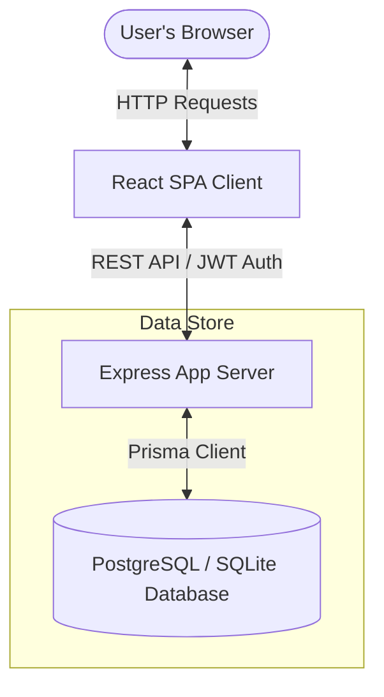
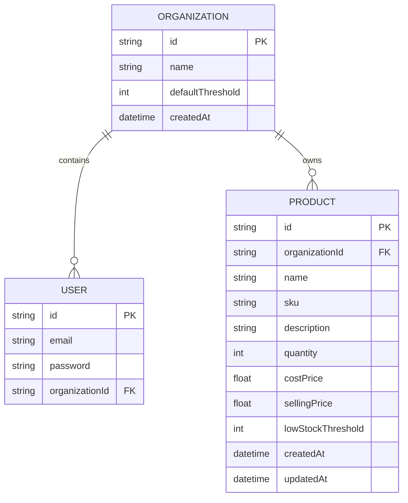

# StockFlow MVP — Architecture & Design Document

This document details the system design, data models, API structure, and security isolation mechanisms implemented for the **StockFlow MVP** inventory system.

---

## 1. System Architecture

The platform follows a modern decoupled web app architecture composed of:
- **Frontend SPA (Vite + React)**: A premium glassmorphic dashboard styled using custom CSS variables. It manages views (Dashboard metrics, Product Catalog, and Organization Settings), handles form validations via React Hook Form, and renders real-time state changes with toast feedback.
- **Backend API Server (Node.js Express)**: An ESM-based Node.js server exposing REST API endpoints for user authentication, dashboard analytics, product catalog modifications, and tenant configurations.
- **Data Persistence Layer (Prisma ORM)**: 
  - **Development mode**: A local SQLite database file (`dev.db`).
  - **Production mode**: Render Cloud PostgreSQL.
  - Model definitions and migrations are coordinated using Prisma ORM.
- **Security & Scope Isolation**: Strict JWT authentication. All database query scopes are enforced via Express middleware reading the authenticated user's `organizationId` from the verified token.

---

## 2. Database Schema

The database model separates users and catalog data per tenant (Organization).

### Table Definitions (Prisma Schema)
- **`Organization`**:
  - `id` (String/UUID, Primary Key): Unique tenant identifier.
  - `name` (String): Display name of the business organization.
  - `defaultThreshold` (Int): Default alert threshold limit for low-stock products.
- **`User`**:
  - `id` (String/UUID, Primary Key): Unique user identifier.
  - `email` (String, Unique): Authentication credential.
  - `password` (String): Bcrypt hashed password.
  - `organizationId` (String, Foreign Key): References `Organization(id)`.
- **`Product`**:
  - `id` (String/UUID, Primary Key): Catalog item identifier.
  - `organizationId` (String, Foreign Key): References `Organization(id)`.
  - `name` (String): Product descriptor.
  - `sku` (String): Stock Keeping Unit code.
  - `description` (String, Optional): Detail text.
  - `quantity` (Int): Physical items count in inventory.
  - `costPrice` (Float): Price paid to purchase or manufacture the item.
  - `sellingPrice` (Float): Retail price displayed to consumers.
  - `lowStockThreshold` (Int, Optional): Overrides Organization's `defaultThreshold` if set.
  - **Constraint:** Unique index on `[organizationId, sku]` to prevent duplicate SKUs within the same organization while allowing identical SKUs across different tenants.

---

## 3. Multi-Tenant Security & API Scoping

Strict tenant separation is handled automatically at the routing middleware level:

### JWT Authentication Middleware (`auth.js`)
1. Extract the bearer token from the request header: `Authorization: Bearer <token>`.
2. Verify token validity using the global `JWT_SECRET`.
3. Inject the decoded token payload (containing `id`, `email`, and `organizationId`) directly to the request object: `req.user`.

### Scoped API Controllers
All CRUD endpoints are dynamically structured to filter queries using `req.user.organizationId`:
- **Read catalog:** `prisma.product.findMany({ where: { organizationId: req.user.organizationId } })`
- **Write product:** `prisma.product.create({ data: { ...productData, organizationId: req.user.organizationId } })`
- **Verify ownership:** Any `PUT` or `DELETE` checks `where: { id: req.params.id, organizationId: req.user.organizationId }` to block cross-tenant modifications.

---

## 4. Key Engineering Decisions & Trade-offs

- **Prisma Client Isolation**: Pushing database changes locally runs schema compilation. Since local Windows environments can lock engine libraries (`EPERM` dll lock due to nodemon), the codebase is configured to run schema pushes on startup inside containerized cloud instances.
- **CORS Dynamic Reflection**: To prevent local sandbox networking blockages (`localhost` vs `127.0.0.1` browser access loops), the CORS origin reflects request headers dynamically (`origin: true`) during both local development and cloud execution.
- **No Heavy Background Queue**: Dashboard alerts and metrics are calculated on-the-fly inside database queries rather than caching them. Given the scale of an MVP catalog (usually $<5000$ products per organization), query response times remain low ($<10\text{ms}$).
